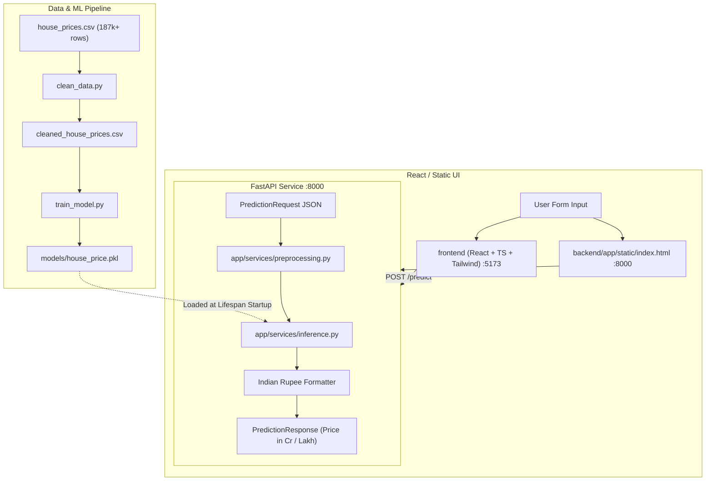

# 🏠 Indian House Price Prediction — Full-Stack AI Application

An end-to-end Machine Learning web application that predicts residential property prices across **80+ Indian cities**. Powered by a trained **Random Forest** regression pipeline served via **FastAPI** with a modern **React & Tailwind CSS** frontend and **Docker Compose** container orchestration.

---

## 📌 Table of Contents

- [Project Architecture](#-project-architecture)
- [Directory Structure](#-directory-structure)
- [Data Pipeline & Modeling](#-data-pipeline--modeling)
  - [1. Data Cleaning (`clean_data.py`)](#1-data-cleaning-cleandatapy)
  - [2. Model Training & Evaluation (`train_model.py`)](#2-model-training--evaluation-trainmodelpy)
- [Backend (FastAPI)](#-backend-fastapi)
- [Frontend (React + Tailwind CSS)](#-frontend-react--tailwind-css)
- [Quick Start Guide](#-quick-start-guide)
  - [Option A: One-Command Python Local Run](#option-a-one-command-python-local-run-easiest)
  - [Option B: Full-Stack React + FastAPI](#option-b-full-stack-react--fastapi)
  - [Option C: Docker Compose](#option-c-docker-compose-production-ready)
- [API Reference](#-api-reference)
- [Running Automated Tests](#-running-automated-tests)

---

## 🏗 Project Architecture



---

## 📂 Directory Structure

```
.
├── backend/
│   ├── app/
│   │   ├── api/
│   │   │   └── routes/
│   │   │       └── prediction.py      # GET /health, POST /predict endpoints
│   │   ├── core/
│   │   │   └── config.py              # Environment configuration (pydantic-settings)
│   │   ├── schemas/
│   │   │   └── prediction.py          # Pydantic validation schemas
│   │   ├── services/
│   │   │   ├── preprocessing.py       # Payload to single-row DataFrame transformation
│   │   │   └── inference.py           # Model singleton loader & prediction runner
│   │   ├── static/
│   │   │   └── index.html             # Direct web UI served at GET /
│   │   ├── utils/
│   │   │   └── logging_config.py      # Structured console logger
│   │   └── main.py                    # FastAPI entrypoint with lifespan startup
│   ├── models/
│   │   └── house_price.pkl            # Trained scikit-learn pipeline artifact
│   ├── tests/
│   │   └── test_prediction.py         # Pytest test suite for health & prediction
│   ├── .env.example                   # Sample environment configuration
│   ├── .env                           # Local environment variables
│   ├── Dockerfile                     # Python 3.11-slim container definition
│   └── requirements.txt               # Backend Python dependencies
│
├── frontend/
│   ├── src/
│   │   ├── api/
│   │   │   └── predictionClient.ts    # Typed fetch client with VITE_API_BASE_URL
│   │   ├── components/
│   │   │   └── PredictionForm.tsx     # Property valuation input form
│   │   ├── pages/
│   │   │   ├── HomePage.tsx           # Landing page with form
│   │   │   ├── ResultPage.tsx         # Valuation display & summary breakdown
│   │   │   └── NotFoundPage.tsx       # 404 page
│   │   ├── types/
│   │   │   └── prediction.ts          # TypeScript type definitions
│   │   ├── App.tsx                    # React Router (/, /result, *)
│   │   ├── index.css                  # Tailwind CSS styles
│   │   └── main.tsx                   # React root entrypoint
│   ├── index.html                     # HTML shell
│   ├── nginx.conf                     # Nginx SPA web server config
│   ├── package.json                   # Dependencies & npm scripts
│   ├── tailwind.config.js             # Tailwind configuration
│   ├── vite.config.ts                 # Vite bundler configuration
│   └── Dockerfile                     # Multi-stage build (Node -> Nginx)
│
├── clean_data.py                      # Standalone data cleaning & feature engineering script
├── train_model.py                     # Standalone ML training & evaluation script
├── house_prices.csv                   # Raw dataset
├── cleaned_house_prices.csv           # Cleaned processed dataset
├── EDA_cleaned.ipynb                  # Original exploration notebook
└── docker-compose.yml                 # Orchestrates backend & frontend containers
```

---

## 🔬 Data Pipeline & Modeling

### 1. Data Cleaning (`clean_data.py`)
Cleans and standardizes raw real estate listings:
- **Location Extraction**: Extracts neighborhood slugs and society names from listing titles (`location_raw`, `locality`).
- **Currency Normalization**: Parses textual currency (`"42 Lac"`, `"1.4 Cr"`) into continuous numeric rupees.
- **Area Standardization**: Standardizes mixed units (`sqyrd`, `sqft`) to uniform square feet (`carpet_area`, `super_area`).
- **Building Metrics**: Parses floor strings (`"10 out of 11"`) into `floor_number`, `building_height`, and derived `floor_ratio`.
- **Discrete Features**: Cleans string annotations (e.g. `"> 5"`) for `bathroom`, `balcony`, and `parking_count`.

```bash
python clean_data.py --input house_prices.csv --output cleaned_house_prices.csv
```

### 2. Model Training & Evaluation (`train_model.py`)
- **Leakage Prevention**: 80/20 train/test split before computing any statistical bounds.
- **Outlier Capping**: Target variable `y_train` and continuous features are capped using IQR bounds derived **strictly** from the training set.
- **Modular `ColumnTransformer` Preprocessing**:
  - `num_pipe`: Median Imputation + `StandardScaler`
  - `ord_pipe`: Most Frequent Imputation + `OrdinalEncoder`
  - `ohe_pipe`: Constant Imputation (`"Missing"`) + `OneHotEncoder`
  - `high_cat_pipe`: Constant Imputation + `OrdinalEncoder`
- **Candidate Models Evaluated**:
  - Linear Regression
  - Ridge Regression
  - Random Forest Regressor ($R^2 \approx 0.8908$) — **Selected as Best Model**
  - XGBoost Regressor ($R^2 \approx 0.8805$)
- **Artifact Export**: Complete fitted pipeline saved to `backend/models/house_price.pkl` with assertion verification.

```bash
python train_model.py --input cleaned_house_prices.csv --output-model-prefix best_model
```

---

## ⚙️ Backend (FastAPI)

- **Model Lifecycle**: Loads the 67MB pipeline artifact once at startup into memory using FastAPI's `lifespan` context manager.
- **Settings Management**: Type-safe configuration via `pydantic-settings` reading from `.env`.
- **Preprocessing Service**: Transforms raw JSON requests into a single-row Pandas DataFrame matching exact column ordering expected by `ColumnTransformer`.
- **Currency Formatter**: Automatically converts numeric output into Indian numbering notation (e.g., `₹1.25 Cr` or `₹45.50 Lakh`).

---

## 🎨 Frontend (React + Tailwind CSS)

- **Interactive Calculator Form**: Grouped into Location, Size, Layout, Building, and Property Details sections.
- **City Autocomplete**: Real-time filtering across 80+ supported Indian cities.
- **Dynamic Calculation**: Real-time server-side and client-side `floor_ratio` calculation.
- **React Router Navigation**: Routes for `/` (estimator), `/result` (price display & summary), and `*` (404).

---

## 🚀 Quick Start Guide

### Option A: One-Command Python Local Run (Easiest)

1. Open your terminal in the project root:
   ```bash
   cd backend
   pip install -r requirements.txt
   python -m uvicorn app.main:app --host 0.0.0.0 --port 8000 --reload
   ```
2. Open your browser:
   - 🌐 **Interactive Web App**: [http://localhost:8000](http://localhost:8000)
   - 📄 **Interactive Swagger API Docs**: [http://localhost:8000/docs](http://localhost:8000/docs)

---

### Option B: Full-Stack React + FastAPI

**Terminal 1 (Backend):**
```bash
cd backend
python -m uvicorn app.main:app --host 0.0.0.0 --port 8000 --reload
```

**Terminal 2 (Frontend):**
```bash
cd frontend
npm install
npm run dev
```
- 🌐 **Frontend**: [http://localhost:5173](http://localhost:5173)

---

### Option C: Docker Compose (Production Ready)

Run the entire containerized stack with a single command:
```bash
docker compose up --build
```
- 🌐 **Frontend (Nginx)**: [http://localhost:5173](http://localhost:5173) or [http://localhost](http://localhost)
- ⚙️ **Backend API**: [http://localhost:8000](http://localhost:8000)

*(To stop the containers, press `Ctrl + C` or run `docker compose down`)*

---

## 📖 API Reference

### `GET /health`
Returns system status and model readiness.
```json
{
  "status": "ok",
  "model_loaded": true
}
```

### `POST /predict`
Accepts property attributes and returns the predicted price.

**Sample Request Body:**
```json
{
  "location": "mumbai",
  "locality": "Andheri West",
  "location_raw": "Andheri West, Mumbai",
  "transaction": "Resale",
  "furnishing": "Semi-Furnished",
  "facing": "East",
  "overlooking": "Garden/Park",
  "ownership": "Freehold",
  "carpet_area": 850.0,
  "super_area": 1100.0,
  "bathroom": 2.0,
  "balcony": 1.0,
  "parking_count": 1.0,
  "floor_number": 5.0,
  "building_height": 15.0
}
```

**Sample Response:**
```json
{
  "predicted_price": 15685.33,
  "formatted_price": "₹15,685"
}
```

---

## 🧪 Running Automated Tests

Run the backend integration test suite with `pytest`:

```bash
cd backend
python -m pytest tests/test_prediction.py -v
```

**Test Coverage Includes:**
- ✅ `test_health_check`: Validates `/health` status and model lifecycle.
- ✅ `test_predict_valid_payload`: Tests end-to-end prediction on a complete feature set.
- ✅ `test_predict_minimal_payload`: Tests pipeline imputation with optional/missing fields.
- ✅ `test_predict_invalid_payload_missing_required`: Validates 422 error on missing required fields.

---

## 👨‍💻 Tech Stack

- **ML & Data Science**: `scikit-learn`, `xgboost`, `pandas`, `numpy`, `joblib`, `scipy`
- **Backend API**: `FastAPI`, `Pydantic v2`, `pydantic-settings`, `uvicorn`, `pytest`, `httpx`
- **Frontend**: `React 18`, `TypeScript`, `Tailwind CSS`, `React Router v6`, `Vite`
- **DevOps**: `Docker`, `Docker Compose`, `Nginx`
