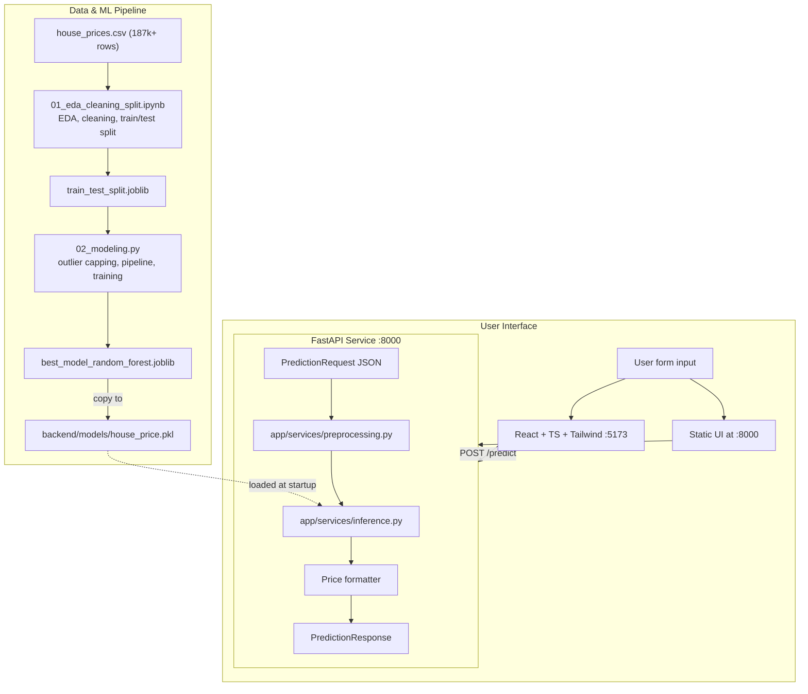

# 🏠 Indian House Price Prediction

An end-to-end machine learning project that predicts residential property prices across **80+ Indian cities**, from raw messy listings to a deployed web app.

A **Random Forest** pipeline (preprocessing + model in one artifact) is served by **FastAPI**, with a **React + Tailwind CSS** frontend and **Docker Compose** orchestration.


---

## 📌 Table of Contents

- [Highlights](#-highlights)
- [Project Architecture](#-project-architecture)
- [Directory Structure](#-directory-structure)
- [Data Pipeline & Modeling](#-data-pipeline--modeling)
  - [Notebook + Script Workflow](#notebook--script-workflow)
  - [Features Used by the Model](#features-used-by-the-model)
  - [Model Results](#model-results)
- [Backend (FastAPI)](#-backend-fastapi)
- [Frontend (React + Tailwind CSS)](#-frontend-react--tailwind-css)
- [Quick Start](#-quick-start)
- [API Reference](#-api-reference)
- [Running Automated Tests](#-running-automated-tests)
- [Troubleshooting](#-troubleshooting)
- [Tech Stack](#-tech-stack)

---

## ✨ Highlights

- **Leakage-safe ML pipeline**: the train/test split happens *before* any outlier capping, imputation, or scaling. Every statistic is learned from the training set only.
- **Single deployable artifact**: preprocessing and model are saved together, so raw input goes straight into `.predict()`.
- **Four models compared**: Linear Regression, Ridge, Random Forest, XGBoost. The best by test R² is saved automatically.
- **Easy to run**: plain Python (FastAPI serves the UI), React + FastAPI, or Docker Compose.
- **Tested API**: pytest suite covering health, valid, minimal, and invalid payloads.

---

## 🏗 Project Architecture



The trained pipeline is produced in the project root and then copied into `backend/models/` for the API to load.

---

## 📂 Directory Structure

```
.
├── backend/
│   ├── app/
│   │   ├── api/routes/prediction.py   # GET /health, POST /predict
│   │   ├── core/config.py             # Environment config (pydantic-settings)
│   │   ├── schemas/prediction.py      # Pydantic validation schemas
│   │   ├── services/
│   │   │   ├── preprocessing.py       # Payload -> single-row DataFrame
│   │   │   └── inference.py           # Model singleton loader & prediction
│   │   ├── static/index.html          # Direct web UI served at GET /
│   │   ├── utils/logging_config.py    # Structured console logger
│   │   └── main.py                    # FastAPI entrypoint (lifespan startup)
│   ├── models/house_price.pkl         # Trained scikit-learn pipeline
│   ├── tests/test_prediction.py       # Pytest suite
│   ├── .env.example                   # Sample environment config
│   ├── Dockerfile                     # Python 3.11-slim image
│   └── requirements.txt
│
├── frontend/
│   ├── src/
│   │   ├── api/predictionClient.ts    # Typed fetch client (VITE_API_BASE_URL)
│   │   ├── components/PredictionForm.tsx
│   │   ├── pages/                     # HomePage, ResultPage, NotFoundPage
│   │   ├── types/prediction.ts
│   │   ├── App.tsx                    # Routes: /, /result, *
│   │   ├── index.css                  # Tailwind styles
│   │   └── main.tsx
│   ├── index.html
│   ├── nginx.conf                     # SPA web server config
│   ├── package.json
│   ├── tailwind.config.js
│   ├── vite.config.ts
│   └── Dockerfile                     # Multi-stage build (Node -> Nginx)
│
├── 01_eda_cleaning_split.ipynb        # Part 1: setup -> cleaning -> train/test split
├── 02_modeling.py                     # Part 2: outliers -> pipeline -> models -> save
├── house_prices.csv                   # Raw dataset
├── train_test_split.joblib            # Generated by 01, consumed by 02
├── best_model_random_forest.joblib    # Generated by 02 (full fitted pipeline)
└── README.md
```

---

## 🔬 Data Pipeline & Modeling

### Notebook + Script Workflow

The original notebook is split at the train/test boundary, so everything before the split is exploratory and everything after it is leakage-sensitive.

| File | Sections | What it does |
|---|---|---|
| `01_eda_cleaning_split.ipynb` | 1 to 6 | Load data, inspect, drop useless columns, clean every column, visualize, **train/test split**. Ends by saving the split to `train_test_split.joblib`. |
| `02_modeling.py` | 7 to 13 | Load the split, cap outliers, build the `ColumnTransformer`, train and compare models, save the best pipeline. |

```bash
# 1. Run every cell of the notebook (writes train_test_split.joblib)
jupyter notebook 01_eda_cleaning_split.ipynb

# 2. Run the modeling script from the SAME folder
python 02_modeling.py
```

> **Run from the project folder.** Both files use relative paths (`house_prices.csv`, `train_test_split.joblib`, the saved model). If you launch from another directory you will get a `FileNotFoundError`. See [Troubleshooting](#-troubleshooting).

**What happens in the notebook (1 to 6):**

1. **Setup & loading**: read `house_prices.csv`.
2. **Inspection**: dtypes, summary statistics, missingness.
3. **Drop useless columns**: `Index` (row counter), `Dimensions` and `Plot Area` (100% missing).
4. **Column-by-column cleaning & feature engineering**:
   - **Location**: extract `location_raw` from the listing title and derive `locality` (society prefix removed).
   - **Currency**: parse `"42 Lac"` / `"1.40 Cr"` into rupees (`Lac` = 1e5, `Cr` = 1e7).
   - **Area**: convert `sqft` and `sqyrd` (1 sqyrd = 9 sqft) to square feet for `carpet_area` and `super_area`.
   - **Floor**: split `"10 out of 11"` into `floor_number` and `building_height`, plus a derived `floor_ratio`. `Ground` = 0, `Upper Basement` = -1, `Lower Basement` = -2.
   - **Discrete counts**: clean `"> 5"` style values in `bathroom` and `balcony`; split `car_parking` into `parking_count` (values above 10 treated as data-entry errors).
   - **Overlooking**: remove `"Not Available"` and sort values so `"A, B"` equals `"B, A"`.
5. **Exploratory visualization**: histograms, boxplots, category counts, mean price by category, correlation heatmap.
6. **Train/test split** (80/20, `random_state=42`): rows with a missing target are dropped, redundant columns are removed (`car_parking`, `parking_type`, `title`, `amount_in_rupees`, `society`), then the data is split. `amount_in_rupees` is removed because it duplicates the target's information.

**What happens in the script (7 to 13):**

7. **Target outlier handling**: IQR bounds computed on `y_train` only, then applied to both `y_train` and `y_test`.
8. **Feature outlier handling**: IQR capping for continuous features (bounds learned from `X_train`), plus threshold caps: `bathroom` ≤ 5, `balcony` ≤ 5, `parking_count` ≤ 3.
9. **Re-visualization** after capping.
10. **Preprocessing pipeline** (`ColumnTransformer`), described below.
11. **Training & evaluation** of four models.
12. **Save the best model** by test R² with `joblib`, then reload it and assert the predictions match.
13. **Summary & key takeaways**.

### Features Used by the Model

| Group | Features | Preprocessing |
|---|---|---|
| **Numeric** | `carpet_area`, `super_area`, `floor_number`, `building_height`, `floor_ratio`, `parking_count` | Median imputation + `StandardScaler` |
| **Ordinal** | `furnishing`, `bathroom`, `balcony` | Most-frequent imputation + `OrdinalEncoder` |
| **Low-cardinality categorical** | `transaction`, `facing`, `ownership` | Constant imputation (`"Missing"`) + `OneHotEncoder` |
| **High-cardinality categorical** | `location`, `locality`, `overlooking`, `location_raw` | Constant imputation (`"Missing"`) + `OrdinalEncoder` |

Unknown categories at prediction time are handled safely (`OneHotEncoder` ignores them; `OrdinalEncoder` maps them to -1).

### Model Results

All four models are wrapped with the same `preprocessor` in a single `Pipeline`, so preprocessing is fit on training data only.

| Model | Test R² |
|---|---|
| Linear Regression | ~0.23 |
| Ridge | ~0.23 |
| **Random Forest** (selected) | **~0.89** |
| XGBoost | ~0.88 |

Exact figures vary slightly between runs. The comparison table printed at the end of training includes train and test R², RMSE, and MAE.

---

## ⚙️ Backend (FastAPI)

- **Model lifecycle**: the pipeline artifact is loaded once at startup into memory through FastAPI's `lifespan` context manager.
- **Settings**: type-safe configuration with `pydantic-settings`, read from `.env`.
- **Preprocessing service**: turns the JSON request into a single-row DataFrame whose columns match the order the `ColumnTransformer` expects.
- **Response formatting**: the numeric prediction is returned alongside a formatted ₹ string.

---

## 🎨 Frontend (React + Tailwind CSS)

- **Valuation form**: grouped into Location, Size, Layout, Building, and Property Details sections.
- **City autocomplete**: real-time filtering across 80+ supported Indian cities.
- **Live `floor_ratio`**: calculated as you type, and again server-side.
- **Routing**: `/` (estimator), `/result` (price and summary), `*` (404).

---

## 🚀 Quick Start

### Step 0: Put the trained model where the backend expects it

After running `02_modeling.py`, copy the model into the backend (a `.pkl` extension is fine; it is the same joblib file):

```powershell
# from the project root (Windows PowerShell)
New-Item -ItemType Directory -Force backend\models | Out-Null
Copy-Item best_model_random_forest.joblib backend\models\house_price.pkl
```

```bash
# macOS / Linux
mkdir -p backend/models && cp best_model_random_forest.joblib backend/models/house_price.pkl
```

Skip this step if `backend/models/house_price.pkl` already exists.

### Option A: Python only (easiest)

```bash
cd backend
pip install -r requirements.txt
python -m uvicorn app.main:app --host 0.0.0.0 --port 8000 --reload
```

- 🌐 Web app: http://localhost:8000
- 📄 Swagger docs: http://localhost:8000/docs
- ✅ Health check: http://localhost:8000/health (should show `"model_loaded": true`)

Keep the terminal open while using the site. Stop the server with `Ctrl + C`.

### Option B: React + FastAPI

**Terminal 1 (backend):**
```bash
cd backend
python -m uvicorn app.main:app --host 0.0.0.0 --port 8000 --reload
```

**Terminal 2 (frontend):**
```bash
cd frontend
npm install
npm run dev
```

- 🌐 Frontend: http://localhost:5173

### Option C: Docker Compose (production-ready)

Requires a `docker-compose.yml` in the project root.

```bash
docker compose up --build
```

- 🌐 Frontend (Nginx): http://localhost:5173 or http://localhost
- ⚙️ Backend API: http://localhost:8000

Stop with `Ctrl + C` or `docker compose down`.

---

## 📖 API Reference

### `GET /health`

Returns system status and model readiness.

```json
{
  "status": "ok",
  "model_loaded": true
}
```

### `POST /predict`

Accepts property attributes and returns the predicted price.

**Request body:**

```json
{
  "location": "mumbai",
  "locality": "Andheri West",
  "location_raw": "Andheri West, Mumbai",
  "transaction": "Resale",
  "furnishing": "Semi-Furnished",
  "facing": "East",
  "overlooking": "Garden/Park",
  "ownership": "Freehold",
  "carpet_area": 850.0,
  "super_area": 1100.0,
  "bathroom": 2.0,
  "balcony": 1.0,
  "parking_count": 1.0,
  "floor_number": 5.0,
  "building_height": 15.0
}
```

**Response:**

```json
{
  "predicted_price": 15685.33,
  "formatted_price": "₹15,685"
}
```

Missing optional fields are handled by the pipeline's imputers; missing required fields return a `422`.

---

## 🧪 Running Automated Tests

```bash
cd backend
python -m pytest tests/test_prediction.py -v
```

| Test | Checks |
|---|---|
| `test_health_check` | `/health` status and model lifecycle |
| `test_predict_valid_payload` | End-to-end prediction on a complete feature set |
| `test_predict_minimal_payload` | Imputation with optional or missing fields |
| `test_predict_invalid_payload_missing_required` | `422` on missing required fields |

---

## 🛠 Troubleshooting

**`FileNotFoundError: train_test_split.joblib` (or `house_prices.csv`)**
Relative paths resolve against the folder your terminal is in, not the folder the script lives in. Change into the project folder first:

```bash
cd "path/to/project"
python 02_modeling.py
```

**`02_modeling.py` fails on load**
Run `01_eda_cleaning_split.ipynb` end to end first. The script depends on the `train_test_split.joblib` file its last cell creates.

**Saved model lands in the wrong folder**
The model is saved relative to the current working directory. Run from the project folder, then copy it to `backend/models/house_price.pkl` (see Step 0).

**Health check shows `"model_loaded": false`, or the server fails at startup**
Make sure `backend/models/house_price.pkl` exists, and that the backend's `scikit-learn` and `xgboost` versions match the ones used to train the model. A model pickled with one version may not load under a very different one.

**Port 8000 already in use**
Start on another port, e.g. `--port 8001`, and open that port instead.

---

## 👨‍💻 Tech Stack

- **ML & data science**: `scikit-learn`, `xgboost`, `pandas`, `numpy`, `scipy`, `matplotlib`, `seaborn`, `joblib`
- **Backend**: `FastAPI`, `Pydantic v2`, `pydantic-settings`, `uvicorn`, `pytest`, `httpx`
- **Frontend**: `React 18`, `TypeScript`, `Tailwind CSS`, `React Router v6`, `Vite`
- **DevOps**: `Docker`, `Docker Compose`, `Nginx`
